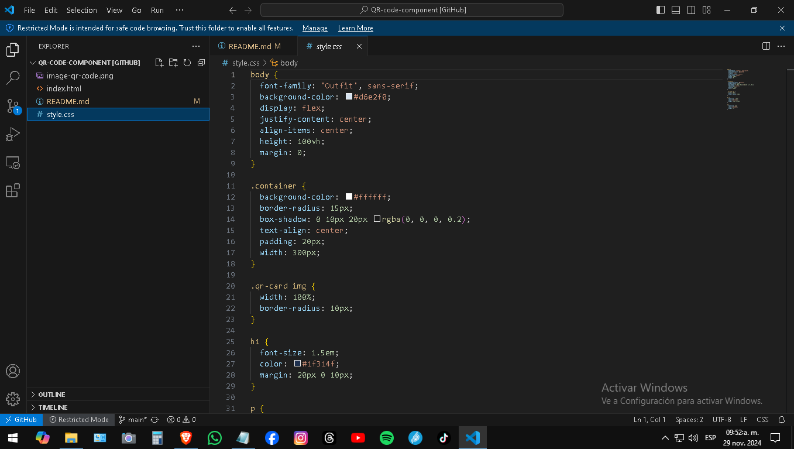

# QR-code-component
# Frontend Mentor - QR code component

This is my solution to the [QR code component challenge on Frontend Mentor](https://www.frontendmentor.io/challenges/qr-code-component-iux_sIO_H). This project helped me practice responsive design, using Flexbox for layout, and enhancing my understanding of HTML and CSS.

## Table of contents

- [Overview](#overview)
  - [Screenshot](#screenshot)
  - [Links](#links)
- [My process](#my-process)
  - [Built with](#built-with)
  - [What I learned](#what-i-learned)
  - [Continued development](#continued-development)
  - [Useful resources](#useful-resources)
- [Author](#author)
- [Acknowledgments](#acknowledgments)

## Overview

### Screenshot

### Links

- Solution URL: [https://github.com/carliytox/QR-code-component](https://github.com/carliytox/QR-code-component)
- Live Site URL: [https://carliytox.github.io/QR-code-component/](https://carliytox.github.io/QR-code-component/)

## My process

### Built with

- Semantic HTML5 markup
- CSS custom properties
- Flexbox
- Mobile-first workflow

### What I learned

During this project, I learned how to implement a mobile-first design, used Flexbox for the layout, and refined my CSS skills. I also became more comfortable with Git for version control.

### Continued development

I will continue practicing Flexbox and working on making my design responsive. In future projects, I plan to experiment with CSS Grid and explore more advanced responsive design techniques.

### Useful resources

- [CSS Tricks](https://css-tricks.com) - A great resource for learning CSS techniques.
- [MDN Web Docs](https://developer.mozilla.org/en-US/) - The Mozilla Developer Network is my go-to for documentation.

## Author

- Website - [Carliytox](https://github.com/Carliytox)
- Frontend Mentor - [@carliytox](https://www.frontendmentor.io/profile/carliytox)
- Twitter - [@carliytox](https://www.twitter.com/carliytosh)

## Acknowledgments

Thanks to the Frontend Mentor community for the challenge and support. Also, a big thank you to the resources I used to deepen my understanding of CSS and Flexbox.
